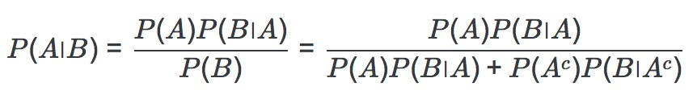

## Introduction

* Review of Probability
* Naive Bayes
* Decision Tress, Randorm Forest
* Support Vector Machine : 분류(Classification 에서 가장 많이 쓰임)
* Ensemble Learning : 앙상블 러닝
* Application of ML to computervision, NLP, etc
* Neural network

## Probability & Naive Bayes

### 조건부 확률

* P(Y=y|X=x) : 구름(X)이 꼈을때(true) 비(Y)가 올 확률을 의미함.
* 
  - 출처 [위키피디아 : 조건부 확률](https://ko.wikipedia.org/wiki/%EC%A1%B0%EA%B1%B4%EB%B6%80_%ED%99%95%EB%A5%A0)
* P(E|F) = P(E and F)/P(F)
* 곱셈 정리 : P(E and F) = P(E|F) * P(F)
* 치환 정리 : P(E|F) * P(F) = P(F|E) * P(E)
* 한 개의 주사위를 두 번 던질 때 합이 3이 나올 확률 vs 두 개의 주사위를 던져서 합이 3이 나올 확률
  : (1/6*1/6)/1/6 = 1/6   vs 2/36 = 1/18
* 표본 공간이 바뀌었다(축소 표본 공간)
* 1개의 주사위를 네번 굴려서 6이 한번 나오는 경우 vs 2개의 주사위를 24번 굴려서 동시에 6이 한번 나오는 경우 ( 드 메레 문제 )
  : 여사건 정의(1-P(E))를 통해서 풀어야 하는데 그 이유는 처음에 6이 나오면 표본공간 자체가 필요없어지기 때문에
    절대 안나오는 확률을 기준으로 계산을 한 다음에 여사건 정의로 푼다 1 - (5/6)^4 = 0.518
  : 같은 방법. 표본공간을 확보하려면 2개의 주사위를 굴려서 동시에 안 나오는 경우는 1 - (35/36)^24 = 0.491

###  베이즈 정리

* 개요 : 베이즈 정리는 1740년대의 영국의 목사인 토머스 베이즈(Thomas Bayes)가 정립한, 조건부 확률에 대한 수학적 정리이다.
사건 A가 있고 사건 B가 있을 때 사건 B가 일어난 것을 전제로 한 사건 A의 조건부 확률을 구하고 싶다. 그런데 지금 알고 있는 것은 사건 A가 일어난 것을 전제로 한 사건 B의 조건부 확률, A의 확률, B의 확률뿐이다. 그럴 때 다음과 같이 구할 수가 있다.
  . 출처 : [나무위키](https://namu.wiki/w/%EB%B2%A0%EC%9D%B4%EC%A6%88%20%EC%A0%95%EB%A6%AC)
  . 
  . 조금 더 풀어 쓰면 - 출처 [나무 위키 베이즈 정리](https://namu.wiki/w/%EB%B2%A0%EC%9D%B4%EC%A6%88%20%EC%A0%95%EB%A6%AC)
* 인구 1000명당 한 명꼴로 걸리는 희귀병. 병에 걸린 사람의 경우는 90% 양성, 건강한 사람의 2% 가 양성
  -> 양성반응을 보인 사람의 병에 걸릴 확률은?
* 즉, 인간의 사고는 처음에는 아무 정보가 없던 상태에서 새로운 정보를 받아들이고, 이를 통해 자신이 가지고 있던 일종의 사전 확률 체계를 업데이트시켜 세상을 해석하거나 판단을 내리고 의사결정을 하는 방향으로 발전되어 왔다는 것이다. 그리고 이렇게 발전된 사후 확률 체계는 새로운 사전 확률이 되어, 새로운 정보가 유입될 때마다 업데이트를 반복해간다. - 나무위키 인지과학 및 인공지능에서의 베이즈 정리
